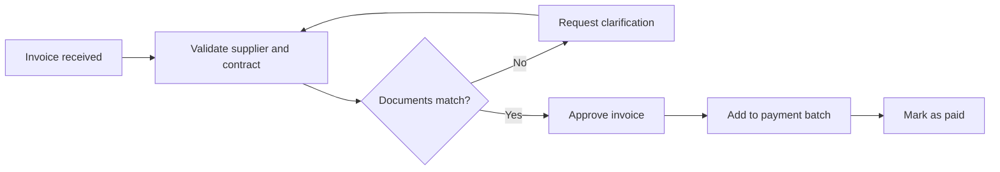
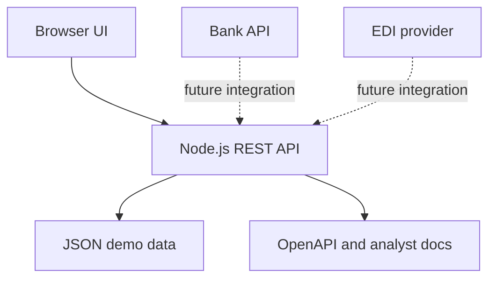

# LedgerFlow Requirements

## 1. Product Context

LedgerFlow is a lightweight internal system for accounting outsourcing teams. The system supports invoice intake, document matching, reconciliation control and payment approval preparation.

## 2. Stakeholders

| Role | Goal |
| --- | --- |
| Accountant | Check incoming invoices and missing primary documents. |
| Finance manager | Prioritize payments using risk, due date and reconciliation variance. |
| Client representative | Review approval status without email chains. |
| Developer | Implement stable API contracts and predictable validation. |

## 3. Scope

### In Scope

- Store incoming invoices with supplier, contract, amount, due date and source.
- Show invoices by status and risk.
- Calculate dashboard metrics for open amount, risk count and matching score.
- Show reconciliation variance by financial area.
- Allow invoice status updates with analyst comments.
- Provide REST endpoints for frontend and integration usage.

### Out of Scope

- Real payment execution.
- Authentication and role management.
- Direct integration with bank production APIs.
- OCR extraction from scanned documents.

## 4. Functional Requirements

| ID | Requirement | Priority | Acceptance Criteria |
| --- | --- | --- | --- |
| REQ-01 | Import invoices from EDI, bank API and manual upload. | Must | Supplier, amount, contract, due date and source are stored. Duplicate invoice IDs are rejected. |
| REQ-02 | Show reconciliation variance by finance area. | Must | Variance equals system balance minus bank balance. Non-zero variance is marked for attention. |
| REQ-03 | Allow analysts to update invoice status with a comment. | Should | Allowed statuses are `draft`, `needs_review`, `approved`, `paid`. Each update appends a comment. |
| REQ-04 | Filter invoice register by status and risk. | Should | Filters can be combined. Empty result is shown as a valid state. |
| REQ-05 | Provide API contract for frontend and integrations. | Must | OpenAPI describes success and error responses. |

## 5. Non-Functional Requirements

| ID | Requirement | Target |
| --- | --- | --- |
| NFR-01 | Dashboard API response time | Under 300 ms for 1000 invoices in test data. |
| NFR-02 | Error format | JSON envelope with `error.message` and optional `error.details`. |
| NFR-03 | Browser support | Current Chrome, Edge and Firefox. |
| NFR-04 | Auditability | Status changes must keep analyst comments. |

## 6. User Stories

| ID | Story | Acceptance Criteria |
| --- | --- | --- |
| US-01 | As an accountant, I want to see invoices that need review, so I can resolve document mismatches first. | Filter `needs_review` returns only matching invoices. High-risk rows are visually marked. |
| US-02 | As a finance manager, I want to see total open amount and reconciliation variance, so I can decide what requires escalation. | Dashboard shows open invoice count, open amount and variance. |
| US-03 | As an analyst, I want to update invoice status with a comment, so the team has an audit trail. | PATCH endpoint validates status and appends a comment. |
| US-04 | As a developer, I want API documentation, so I can connect another client without reading frontend code. | OpenAPI file includes routes, schemas and examples. |

## 7. Business Rules

- Invoice amount must be greater than zero.
- Invoice status can only be one of `draft`, `needs_review`, `approved`, `paid`.
- Invoice with `matchingScore` below 75 should be treated as review candidate.
- Reconciliation row with non-zero variance should be marked as `attention`.
- Paid invoices are excluded from open amount.

## 8. BPMN-Level Process



## 9. UML Component View



## 10. API Error Format

```json
{
  "error": {
    "message": "Unsupported invoice status.",
    "details": {
      "allowedStatuses": ["draft", "needs_review", "approved", "paid"]
    }
  }
}
```

## 11. Definition of Done

- UI loads dashboard data from API.
- Invoice status update works through API.
- API contract test passes.
- Requirements, OpenAPI and SQL documentation are stored in the repository.

